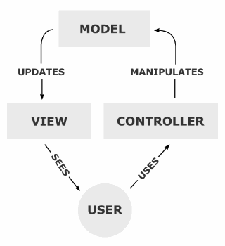

# MVC 패턴

## 👀 참조 링크

📎 <a href="https://m.blog.naver.com/jhc9639/220967034588" target="_blank">MVC Pattern 잘 정리된 사이트</a>

---

## 🐾 목차

> [MVC](#1-mvc-패턴이란)  
> [MVC 패턴 구성요소](#2-mvc-패턴-구성요소)  
> [MVC 패턴 사용 이유](#3-mvc-패턴을-사용하는-이유) > [MVC 패턴의 한계](#4-mvc-패턴의-한계)

---

## 1. MVC 패턴이란?

- 디자인 패턴 중 하나로, MVC는 *Model, View, Controller*의 약어이다
- 하나의 애플리케이션, 프로젝트를 구성할 때, 그 구성요소를 MVC 세가지 역할로 구분한 디자인 패턴을 의미

### (소프트웨어) 디자인패턴이란?

- 프로그래머가 애플리케이션이나 시스템을 디자인할 때 공통된 문제를 해결하는데 쓰이는 형식화 된 가장 좋은 '규약'을 의미
- 완전한 디자인은 아니며 상황에 맞게 쓰임

## 2. MVC 패턴 구성요소

    

사용자가 Controller를 조작하면 Controller는 Model에서 데이터를 가져오고,  
그 정보를 바탕으로 시각적 표현을 담당하는 View를 제어하여 사용자에게 전달한다

### 1) Model

애플리케이션의 정보, 데이터를 의미함  
애플리케이션이 '무엇'을 할 것인지 정의

- 사용자가 편집하길 원하는 데이터를 완전히 보유하고 있어야 함
- 뷰와 컨트롤러에 관한 어떠한 정보도 알지 말아야 함
- 변경이 일어나면, 변경 통지에 관한 처리방법을 구현해야 함

### 2) View

input, checkbox 등 사용자의 인터페이스를 의미함  
"무엇"인가를 보여주는 역할

- Model이 보유한 정보를 따로 갖고 있어서는 안됨
- 모델과 컨트롤러에 관한 어떠한 정보도 알아서는 안됨
- 변경이 일어나면, 변경 통지에 관한 처리방법을 구현해야 함

### 3) Controller

데이터와 사용자 인터페이스를 잇는 _다리역할_  
*이벤트*를 처리하는 부분  
메인 로직은 이곳에서 처리 됨(비즈니스 로직)  
모델을 "어떻게" 처리할지 알려주는 역할

- 모델과 뷰에 관해 알고 있어야 함
- 모델과 뷰의 변경 사항을 모니터링 해야 함

## 3. MVC 패턴을 사용하는 이유

- 크게 3가지 구성으로 애플리케이션을 만들면, 각각 맡은 바에 집중할 수 있음
- 이는 유지보수성과 확장성, 유연성을 높이고, 중복코드를 제거할 수 있다

## 4. MVC 패턴의 한계

애플리케이션의 규모가 커지면 Controller에 View와 Model이 복잡하게 연결되는 현상이 발생할 수 있다  
이를 Massive ViewController라고 부르는데  
MVC가 복잡하고 비대해지면 새 기능을 추가할 때마다 작은 문제점들이 생기고 테스트 하기 어려워진다  
이를 보완하기 위해 MVP, MVVM, Viper 등의 다양한 패턴이 파생외었다
