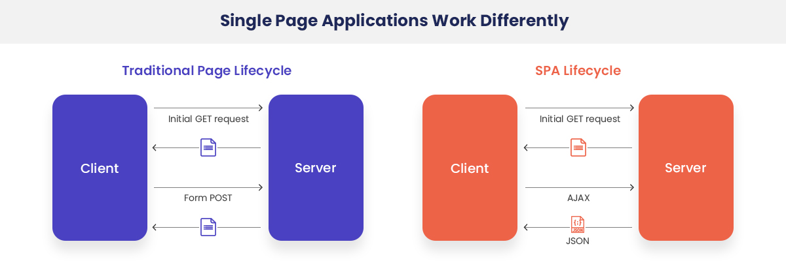

# SSR과 CSR

## 👀 참조 링크

📎 <a href="https://miracleground.tistory.com/165" target="_blank">SSR과 CSR을 정리해놓은 블로그</a>

## 📎 <a href="https://goodgid.github.io/Server-Side-Rendering-and-Client-Side-Rendering/" target="_blank">좋은 이미지 자료가 있는 블로그</a>

## 🐾 목차

> [MPA와 SPA](#1-mpa와-spa)  
> [SSR과 CSR](#2-ssr과-csr)  
> [SSR과 CSR의 장단점](#3-ssr과-csr의-장단점)  
> [각각 언제 사용하면 좋을까?](#4-각각-언제-사용하면-좋을까)

---

## 1. MPA와 SPA

### 1) MPA(Multiple Page Application)

- 전통적인 웹 페이지 구성 방식
- 여러 페이지로 구성된 웹 애플리케이션
- 사용자로부터 인터랙션이 발생할 때마다, 서버로부터 새로운 html을 받아와서 페이지 전체를 다시 로딩하는 방식

### 2) SPA(Single Page Application)

- React, Vue 등 웹 트렌드인 방식
- 하나의 페이지로 구성된 웹 애플리케이션
- 브라우저에 최초 한 번 페이지가 로드된 이후, 변경된 부분에 대해서만 ajax를 통해 데이터를 바인딩하는 방식

## 2. SSR과 CSR

### 1) SSR(Server Side Rendering)

#### (1) 개념

- 서버로부터 완전하게 만들어진 html 파일을 받아와서 페이지 전체를 렌더링하는 방식

#### (2) 동작방식

- 서버로부터 이미 만들어진 html + css, js 파일을 받아옴
- view는 렌더링 되었으나 인터랙션을 할 수 없는 약간의 시차가 발생할 수 있음
- 새로운 요청 시, 다시 전체적인 파일을 다운받아서 새로고침 됨

### 2) CSR(Client Side Rendering)

#### (1) 개념

- 사용자의 요청에 따라, 필요한 부분만 응답받아 렌더링 하는 방식

#### (2) 동작방식

- 초기 화면 로드를 위해 서버에 요청
- 화면에 표시하는데 필요한 완전한 리소스를 응답
- 새로운 요청 시, 필요한 것만 변경됨

## 3. SSR과 CSR의 장단점

### 1) SSR

#### (1) 장점

- 초기로딩 속도가 빠름(FCP)
- SEO 친화적: 화면을 구성하는 각각의 페이지가 있기 때문에

#### (2) 단점

- 사용자 경험이 좋지 않음: 새로고침 시 깜빡거림, TTI와 TTV의 시차로 인한 상호작용 불가능한 시점이 있음
- 서버의 부하가 증가

### 2) CSR

#### (1) 장점

- 사용자 경험이 좋음
- 서버의 부하가 덜함

#### (2) 단점

- 초기로딩 속도가 느림(FCP)
- SEO에 좋지 않음

### 3) SEO에 관하여

CSR 방식이 검색엔진 최적화에 좋지 않은 이유는 많은 크롤러들이 JavaScript를 지원하지 않기 때문  
구글봇은 자바스크립트를 지원하기 때문에 CSR의 SEO에도 적합함

## 4. 각각 언제 사용하면 좋을까?

*Contents의 특성*에 따라서 활용하면 좋음

### 1) SSR

- 초기로딩이 빨라야 할 때
- SEO가 중요할 때
- 유저와의 상호작용이 적을 때
- 네트워크가 느릴 때

### 2) CSR

- SEO가 상대적으로 중요하지 않을 때
- 유저와의 상호작용이 많을 때
- 메인스크립트의 크기가 작을 때

---

그 외의 이미지들

