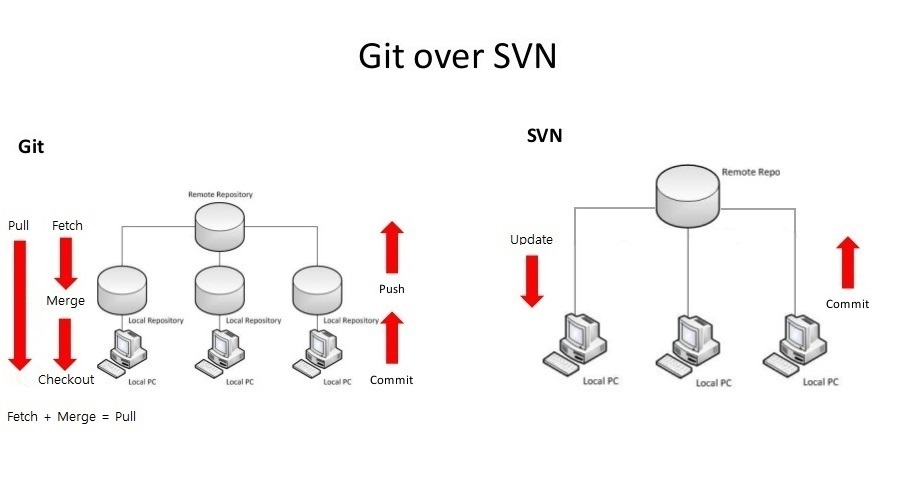

# git

## 👀 참조 링크

📎 <a href="https://maivve.tistory.com/281" target="_blank">git과 svn 관련 블로그</a>

---

## 🐾 목차

> [git이란?](#1-git이란)  
> [git과 github](#2-git과-github)  
> [git과 SVN](#3-git과-svn)

---

## 1. git이란?

- 형상관리도구(Configuration Management Tool) 중 하나: Version Control System(VCS)이라고도 하며 소스코드 수정에 따른 버전을 관리하는 도구
- _분산형 소스코드 관리 시스템_
- 소프트웨어를 개발하는 기업의 핵심 자산인 소스코드를 효율적으로 관리할 수 있게 해주는 무료이자, 오픈 소프트웨어

## 2. git과 github

### 1) git

- *로컬*에서 관리되는 VCS

### 2) github

- _클라우드_ 방식으로 관리되는 VCS
- 웹호스팅 서비스

즉, 개인적으로 코드를 관리하고싶다면 git만을 사용해서 소스코드를 관리해도 됨  
협업을 해야하는 상황이라면 github 서버에 원격 저장소를 두고 버전관리를 할 수 있음

## 3. git과 SVN

### 1) SVN(Sub Version)

_중앙 집중식 코드 관리 방식_  
내 PC의 코드를 commit하면 바로 중앙 저장소에 반영됨

#### (1) 장점

- 매우 직관적임
- 내가 commit을 할 경우 모든 사람에게 공유됨

#### (2) 단점

- 빈번한 충돌 가능성: 여러 사람이 동시에 같은 파일을 수정하게 되면 충돌이 발생하게 됨
- 중앙서버에 문제가 발생하면 모든 작업이 마비될 수 있음
- 모든 사람의 히스토리가 함께 저장되기 때문에 내가 커밋한 히스토리를 찾으려면 힘들 수 있음

### 2) git

_분산 코드 관리 방식_  
협업 참여자들은 각자 로컬 PC에 소스코드를 보유하고 있으며, 로컬에 commit이 쌓임  
원격 저장소로 push하기 전에, confilct 가능성이 있는 파일들을 수정 후 merge하게 됨

#### (1) 장점

- 오프라인에서도 수정이 용이
- 개발 시 처리 속도가 빠름
- branch와 merge의 상호작용으로 충돌 가능성이 낮음
- 원격 저장소에 문제가 생기더라도 빠르게 복구가 가능함
- 히스토리 관리가 용이

#### (2) 단점

- git과 관련된 용어와 개념에 적응하는데 시간이 걸릴 수 있음
